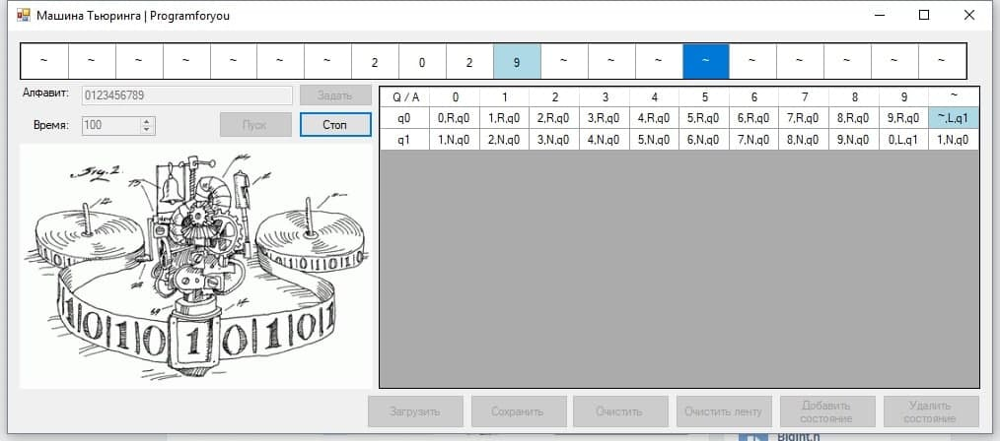

# Эмулятор машины Тьюринга

Реализовать эмулятор машины Тьюринга.
Машина Тьюринга задаётся пользователем в виде таблицы состояний и переходов.
Имеется возможность как пошагового выполнения, так и запуска до останова.

## Возможности эмулятора
* ввод алфавита, начального состояния ленты, таблицы правил и начального положения каретки
* свободная форма записи правил
* валидация пользовательского ввода
* сохранение состояния эмулятора или только таблицы правил в файл
* загрузка состояния эмулятора или только таблицы правил из файла
* изменение языка графического пользовательского интерфейса

## Пользовательские интерфейсы
* графический интерфейс на tkinter
* web-интерфейс на HTML, CSS, JS
* серверный интерфейс на Flask

### Макет графического и web-интерфейсов


### Серверный интерфейс
Пользователь может отправить POST запрос, содержащий конфигурацию машины Тьюринга и получить результат работы эмулятора в виде JSON.

#### Входной формат:
Запрос содержит следующие поля:

* `alphabet` — алфавит машины Тьюринга
* `tape` — начальное состояние ленты
* `mode` — режим работы (`"by step"` для пошагового выполнения или `"normal"` для выполнения до останова)
* `rules` — правила машины Тьюринга в виде словаря словарей
* `head_position` — положение каретки относительно первого символа в переданном состоянии ленты (необязательный параметр, по умолчанию равен 0)
* `max_iterations` — максимальное количество тактов выполнения машиной Тьюринга (по умолчанию 9999)

#### Пример запроса

```json
{
    "alphabet": "ab",
    "tape": "aabaab",
    "mode": "normal",
    "rules": {
        "q0": {
            "a": ["a", "R", "q1"],
            "b": ["b", "R", "q1"],
            "~": ["~", "N", "!"]
            }
        },
        "q1": {
            "a": ["b", "R", "q0"],
            "b": ["a", "R", "q0"],
            "~": ["~", "N", "!"]
        }
    }
}
```

#### Выходной формат
Ответом на запрос является JSON со следующими полями:

* `status` — строка `"successful"` в случае успешного завершения или `"max iterations reached"` в случае достижения максимального числа итераций
* `iterations` — число итераций, потребовавшихся для работы машины Тьюринга
* `result` — результирующее состояние ленты
* `steps` — лог машины Тьюринга на каждом шаге, поле присутствует только есть был выбран режим пошагового выполнения
* `head_position` — положение каретки относительно первого непустого символа на ленте (0, если результат работы пустая строка)

#### Пример ответа на запрос

```json
{
    "status": "successful",
    "iterations": 7,
    "result": "abbbaa",
    "head_position": 6
}
```
